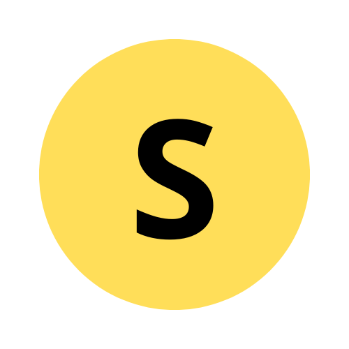

<div style="text-align: center;">
    
</div>

**Suny** is a small programming language built from scratch in C,
designed to help you understand **how interpreters, VMs, and compilers really work** — without magic. 🌇 

> If you enjoy reading compiler code more than tutorials, Suny is for you.

---

## What is Suny? 👀💡

* A **minimal programming language** 
* Written in **pure C** 🗿
* Focused on:

  * parsing
  * AST
  * bytecode / execution
  * memory & runtime design

This project is mainly for:

* people learning **language implementation**
* low-level / systems programmers
* anyone curious about how languages like Lua or Python work internally

---

## Example

```suny
a = [1, 2, 3]
b = [4, 5]

print(a + b)
```

Output:

```
[1, 2, 3, 4, 5]
```

Simple syntax. Explicit behavior. No hidden magic.

---

## Why Suny? 💥🚀

* No external runtime
* Easy-to-read C code
* Every feature is implemented **by hand**
* Meant to be **read, modified, and broken**

This is **not** a production language.
This **is** a learning tool.

---

## Build & Run 📦🧩

### Requirements

* **OS**: Windows 10+ 🪟 or Linux 🐧 **(new)**
* **Compiler**: MinGW (GCC) or MSVC
* **Tools**: `make`

### Steps

```bash
git clone https://github.com/solarity-lab/Suny.git
cd Suny
make
```

After building, you’ll get:

```
suny.exe
```

(Interpreter entry point)

---

## Documentation & Videos

* 📄 **Language spec & internals**:
  👉 [SRM1 Document (PDF)](./SRM/SRM1/document.pdf)

* 🎥 **Implementation walkthroughs & dev logs**:
  👉 [https://www.youtube.com/@haidinhson](https://www.youtube.com/@haidinhson)

---

## Who should NOT use Suny?

* If you want a fast production-ready language ❌
* If pointers and manual memory scare you ❌

## Who SHOULD use it?

* If you want to **learn how languages are built** ✅
* If you read kernel / VM code for fun ✅


